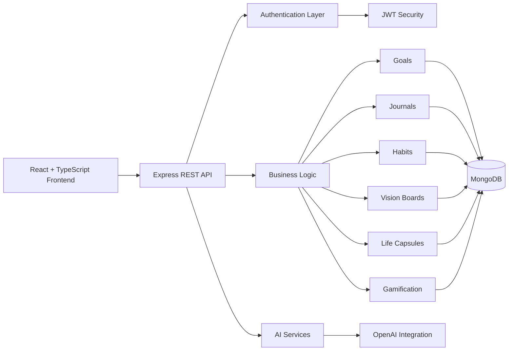

# 🚀 LifeOS
### An AI-Powered Personal Growth Operating System

<p align="center">


</p>

---

## 🌟 Overview

LifeOS is a full-stack AI-powered personal growth platform designed to help individuals document their life journey, transform aspirations into actionable goals, build consistent habits, reflect through intelligent journaling, and visualize long-term progress through a unified digital ecosystem.

Unlike traditional productivity tools that solve isolated problems, LifeOS combines memory preservation, personal development, AI-assisted coaching, social accountability, and gamification into a single integrated experience.

The platform enables users to:

- Capture meaningful life moments
- Organize memories into life chapters
- Set and track personal goals
- Build sustainable habits
- Maintain reflective journals
- Create vision boards
- Receive AI-generated insights
- Transform dreams into actionable plans
- Earn XP and achievements
- Connect with others pursuing growth

---

# 🎯 The Problem

Personal growth tools are fragmented.

People typically store:

- Goals in one application
- Notes in another
- Photos elsewhere
- Journals separately
- Motivation in random videos
- Dreams only in their imagination

As a result:

- Progress becomes invisible
- Reflection becomes inconsistent
- Motivation fades
- Personal growth lacks structure

There is no unified system capable of understanding a person’s memories, goals, emotions, habits, and aspirations simultaneously.

---

# 💡 The Solution

LifeOS introduces the concept of a:

## Personal Life Operating System

A centralized platform where users can:

```text
Dream
 ↓
Plan
 ↓
Act
 ↓
Reflect
 ↓
Grow
 ↓
Repeat
```

By combining AI assistance, structured life documentation, gamification, and growth analytics, LifeOS transforms personal development into a measurable and engaging journey.

---

# ✨ Core Features

## 📖 Life Capsule

Store and organize important memories across different chapters of life.

Supports:

- Personal memories
- Milestones
- Reflections
- Life stories
- Multimedia content

---

## 🎯 Goal Management

Create structured goals and monitor progress.

Features include:

- Goal creation
- Progress tracking
- Goal decomposition
- Milestone planning
- Completion monitoring

---

## 🧠 AI Dream-to-Plan Engine

Transform high-level aspirations into actionable roadmaps.

Example:

```text
Dream:
"I want to become a software engineer."

AI Output:

→ Milestones
→ Action Steps
→ Habits
→ Risks
→ Recommendations
```

---

## 📓 Intelligent Journaling

Users can document experiences and reflections.

The AI system can analyze journal content to generate insights and growth recommendations.

---

## 🌠 Vision Boards

Visualize future aspirations.

Create collections of:

- Dreams
- Goals
- Inspirations
- Life ambitions

---

## 🔥 Habit Tracking

Build consistency through recurring habits.

Track:

- Daily habits
- Completion streaks
- Progress trends

---

## 🏆 Gamification Engine

Personal growth is treated like a game.

Users earn:

- XP
- Levels
- Badges
- Achievements

for engaging with the platform and achieving goals.

---

## 🤝 Social Growth Network

Connect with like-minded individuals.

Includes:

- Friend connections
- Shared accountability
- Collaborative growth experiences

---

## 🔔 Notifications

Real-time engagement through platform notifications.

---

## 📅 Weekly Reviews

Generate periodic summaries of growth activity.

Helps users understand:

- Accomplishments
- Challenges
- Areas for improvement

---

# 🏗 System Architecture



---

# 🧰 Technology Stack

| Layer | Technology |
|---------|------------|
| Frontend | React 18 |
| Language | TypeScript |
| Build Tool | Vite |
| Styling | Tailwind CSS |
| UI Components | Radix UI |
| Data Fetching | TanStack Query |
| Backend | Node.js |
| API Layer | Express |
| Database | MongoDB |
| ODM | Mongoose |
| Authentication | JWT |
| Password Security | bcryptjs |
| File Uploads | Multer |
| AI | OpenAI API |
| Scheduling | node-cron |

---

# 🔒 Security

Implemented security mechanisms include:

### Authentication

- JWT-based authentication
- Protected routes
- Token validation middleware

### Password Security

- bcrypt password hashing

### API Protection

- Route-level authorization middleware
- Rate limiting middleware

### Environment Security

- Environment variable configuration
- Sensitive secrets isolated from source code

### Request Protection

- CORS configuration
- Authentication middleware enforcement

---

# 🧠 AI Capabilities

LifeOS integrates AI directly into the user growth workflow.

Verified AI modules include:

### Dream Transformation

Convert aspirations into structured action plans.

### Journal Analysis

Analyze reflections and generate insights.

### AI Coaching

Provide contextual recommendations.

### Growth Insights

Generate personalized observations based on platform activity.

---

# 📂 Project Structure

```text
LifeOS
│
├── frontend
│   ├── src
│   │   ├── components
│   │   ├── pages
│   │   ├── hooks
│   │   ├── services
│   │   ├── contexts
│   │   └── assets
│
├── backend
│   ├── controllers
│   ├── middleware
│   ├── models
│   ├── routes
│   ├── services
│   ├── utils
│   └── config
│
└── README.md
```

---

# 🚀 Engineering Highlights

This project demonstrates:

### Full-Stack Development

End-to-end application architecture using modern web technologies.

### AI Product Integration

Practical application of large language models within a real user workflow.

### REST API Design

Separation of frontend and backend concerns through a dedicated API layer.

### Database Modeling

Complex interconnected entities including goals, habits, journals, users, memories, badges, and social relationships.

### Scalable Architecture

Modular controllers, routes, services, and middleware structure.

### User-Centered Product Design

Focus on emotional engagement, motivation, reflection, and long-term growth.

---

# 📈 Why This Project Matters

Most software helps people manage tasks.

LifeOS helps people manage their lives.

The platform bridges the gap between:

- Memory preservation
- Personal reflection
- Goal achievement
- Motivation
- AI assistance

creating a single ecosystem designed to help users become intentional about their future.

---

# 🎓 What This Project Demonstrates

As a Computer Science graduate, this project demonstrates:

✅ Full-stack application development

✅ REST API architecture

✅ Authentication and security implementation

✅ MongoDB schema design

✅ AI integration using OpenAI

✅ Prompt engineering workflows

✅ State management and frontend architecture

✅ Product design thinking

✅ Scalability considerations

✅ Real-world software engineering practices

---

# 👩‍💻 Author

**Tatiana Bazouni**

Computer Science Graduate


# 🚀 Future Vision

LifeOS is positioned to evolve into an intelligent lifelong companion capable of:

- Personalized AI coaching
- Long-term behavioral analysis
- Predictive growth recommendations
- Adaptive goal planning
- Cross-device synchronization
- Advanced life analytics

The long-term mission is simple:

> Help people remember who they were, understand who they are, and intentionally build who they want to become.
